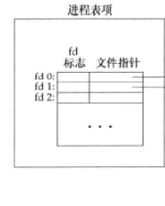
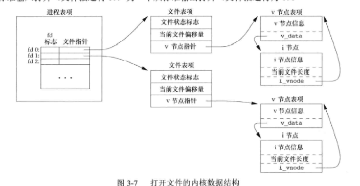

## UNIX内核用于所有I/O的数据结构

​	内核用3种数据结构表示打开文件，它们之间的关系决定了在文件共享方面一个进程对另一个进程可能产生的影响。

（1）每个进程在进程表中都维护着一张文件记录项表，内容有

a，一个文件描述符标志

b,指向一个文件表项的指针。

（2）内核为所有打开文件维护一张文件表，内容包括：

a，文件状态标志（读，写，添写，同步和非阻塞等）

b，当前文件偏移量

c，指向该文件节点v节点表项的指针。

每个进程都有各自的一个文件表项，因为进程都有它对文件的当前偏移量。

（3）每个打开文件（或设备）都有一个v节点(v-node)结构。v节点包含了文件类型和文件进行各种操作函数的指针。大多数文件，v节点还包括i节点(i-node索引节点)，这些信息实在打开文件时从磁盘读入内存的。

