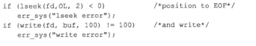

## 1，追加到一个文件

​	一个进程需要将数据追加到文件尾端。早期UNIX并不支持open 的O_APPEND选项，会被编成


​	

​	一个进程进行操作能正常工作，但多进程时会造成数据覆盖这样的逻辑错误（具体分析需要结合到操作系统并发操作所带来的影响可以看操作系统原理同步与互斥这章会详细假关节）。

​	UNIX为这样的操作提供一种原子操作方法，即在文件打开时

设置O_APPEND，在每次写操作前都会把当前文件偏移量设置到文件尾端，于是写之前就不需要调用lseek函数了。


## 2，函数pread和pwrite

​	

```c
#include <unistd.h>
ssize_t pread(int fd, void *buf, size_t nbytes, off_t offset);
ssize_t pwrite(int fd, void *buf, size_t nbytes, off_t offset);
	//返回值类型和read write对应的一样
```

 调用pread/pwrite相当于调用lseek后调用read，但是pread/pwrite又与这种调用顺序有下列重要的区别；

·调用pread时,无法中断其定位和读操作。

·不更新当前文件偏移量。


## 3，创建一个文件

​	对open函数的选定项同时进行 O_CREAT,O_EXCL选项说明时，是一个原子操作。如果不进行这么做，会存在一些并发操作引起的写数据覆盖。

