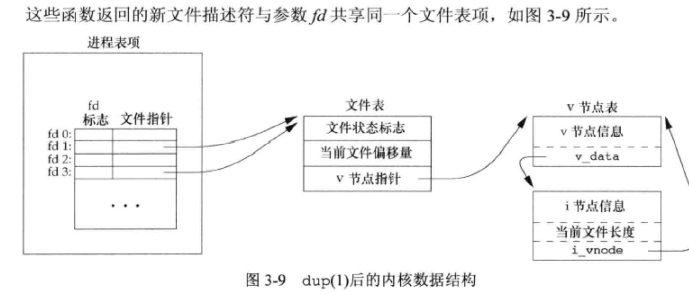

## 功能：

​	用来复制一个现有的文件描述符。


## 函数体

```c
#include <unistd.h>
int dup(int fd);
int dup2(int fd, int fd2);
	//两函数返回值，成功返回新的文件描述符，失败返回-1
```

​	dup函数返回的一定时当前可用文件描述符的最小值（操作系统层面上的处理原理图如下），但对于fd2时指定新的dup2返回值，也就是指定新描述的值，如果fd2打开了则进行关闭，如果fd == fd2 则不关闭。



