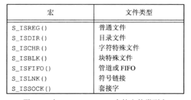
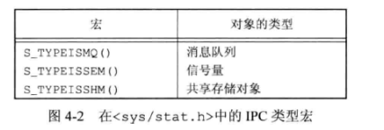

（1）普通文件：最常用的文件类型，包含了某种数据类型（文本或二进制数据），不管是说明类型数据对内核而言都一样。

（2）目录文件：包含了其他文件的名字和指向文件有关信息的指针，具有读权限的进程可以访问目录内容，但只有内核才可以写目录文件

（3）块特殊文件：提供对设备（如磁盘）带缓冲的访问，每次访问以固定长度为单位进行。

（4）字符特殊文件：这种类型的文件提供对设备不带缓冲的访问，每次访问长度可变，系统的所有设备除了字符特殊文件就是块特殊文件，

（5）FIFO：管道通信文件

（6）套接字：用于进程间网络通信，也可以用来同宿主机的非网络通信

（7）符号链接：指向文件的引用（类似快捷方式）


值得一提的是文件类型信息包含在stat结构的st_mode成员中。图中的宏确定文件类型。



POSIX.1允许实现将进程间通信(IPC)对象说明为文件图中的宏可以用stat定义的,用来确定IPC对象的类型，把那个不是st_mode，而是指向stat结构的指针。



注意：早期UNIX并不提供宏，于是就需要将st_mode与屏蔽字S_LFMT进行与运算，然后与名为S_IFxxx的常量进行比较。

如：S_ISDIR;

#define S_IDDIR(mode)   ((mode & S_LFMT  ==  S_IFDIR))

代码示例

```c
#include <stdio.h>
#include <sys/stat.h>

int main(int args,char* argv[])
{
        int i; //用来获取argv中的元素
        struct stat buf;  //创建stat的结构体用来存储文件信息
        char *ptr;

        for(i =i;i<args;i++)
        {
                printf("%s",argv[i]);
                if(lstat(argv[i],&buf)==-1)
                {
                        perror("lstat error");
                        continue;
                }
                
                if(S_ISREG(buf.st_mode))
                        ptr =  "普通文件"; 
                else if(S_ISDIR(buf.st_mode))
                        ptr = "目录";
                else if(S_ISCHR(buf.st_mode))
                        ptr = "字符特殊文件";
                else if(S_ISBLK(buf.st_mode))
                        ptr = "块特殊文件";
                else if(S_ISFIFO(buf.st_mode))
                        ptr = "管道文件";
                else if(S_ISLNK(buf.st_mode))
                        ptr = "符号链接";
                else if(S_ISSOCK(buf.st_mode))
                        ptr = "套接字文件";
                else
                        ptr = "unknown";
                printf(":%s\n",ptr);
        }
        return 0;
}
```

