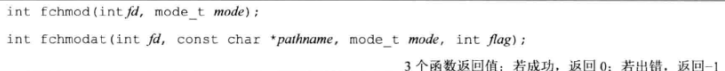
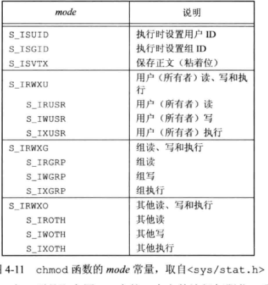

## 功能：

​	这三个函数都能使我们可以更改现有文件的访问权限。


## 函数体：




​	chmod函数是在指定的文件上操作，而fchmod函数则是对已打开的文件进行操作。fchmodat函数与chmod函数在下面两种情况是相同：一种是path是绝对路径，一种是fd位AT_FDCWD而path是相对路径，否则是fchmodat则会计算相对于打开目录（fd参数取值）的pathname，当设置flag为AT_SYMLINK_NOFOLLOW标志时，fchmodat并不会跟随符号链接。

参数mode如下

​	



## 例程

```c
#include <stdio.h>
#include <sys/stat.h>

int main()
{
	struct stat statbuf;
	
	if(stat("foo",&statbuf)<0)
			perror("stat failed");
	if(chmod("foo",(statbuf.st_mode&~S_IXGRP)|S_ISGID))
			perror("chmod failed");
	if(chmod("bar",S_IRUSR|S_IWUSR|S_IRGRP|S_IWGRP))
			perror("chmod bar failed");
	
	return 0;
}
```

通过ls -l发现文件权限改变了，但是更新时间那一项还是上一次修改文件内容的时间。

